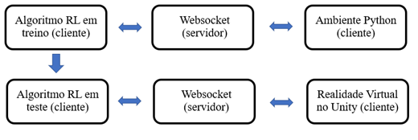
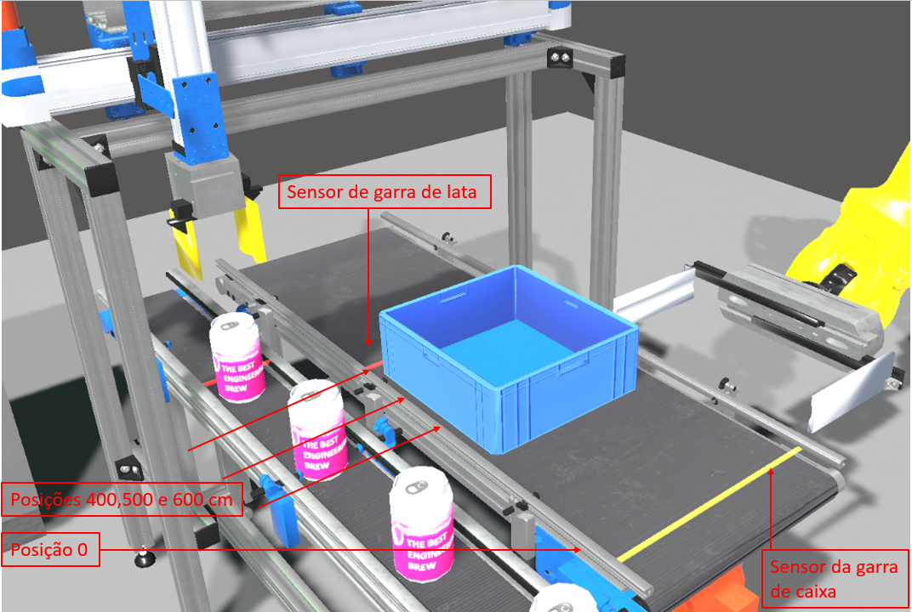
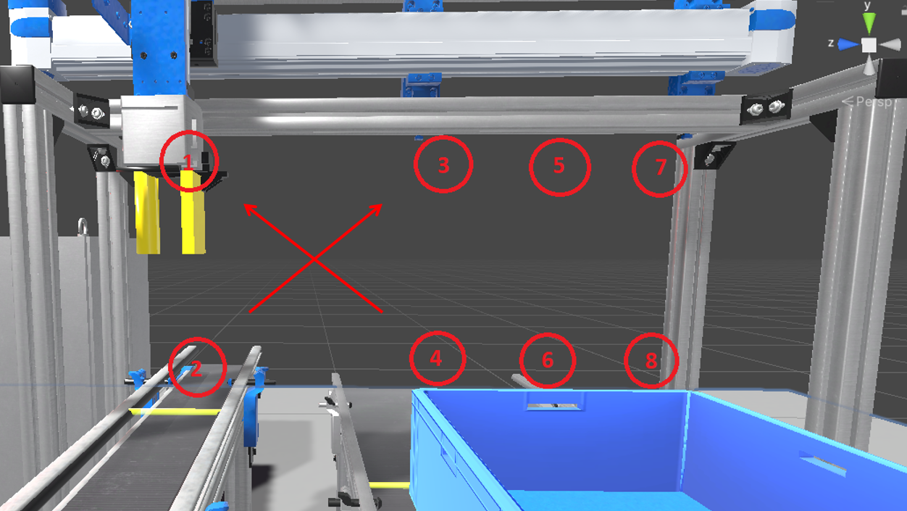
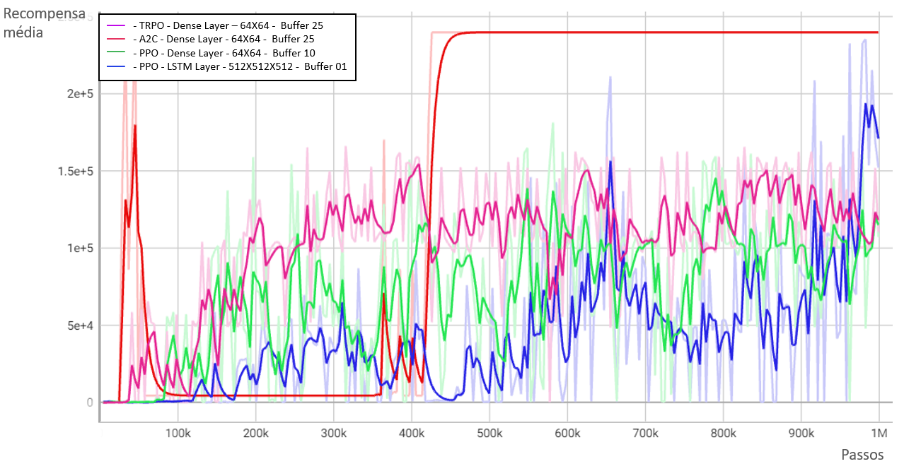
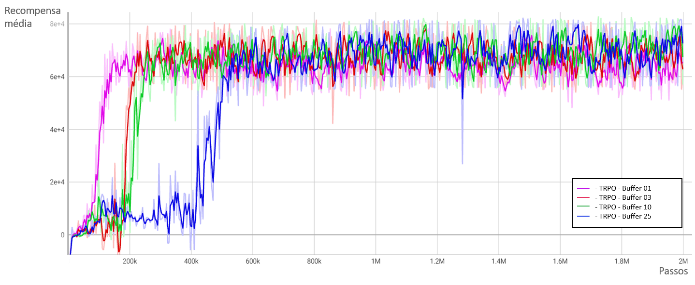

# Aprendizagem por Reforço em Processos Industriais Discretos Sequenciais
 Este é um projeto desenvolvido no âmbito da tese de mestrado ["Comparação de Métodos de Aprendizagem por Reforço em Processos Industriais Discretos Sequenciais"](Thesis/dissertation.pdf), realizada sob a orientação do Doutor Luís Miguel Perdigoto e do Doutor Luís Manuel Conde Bento, na Escola Superior de Tecnologia e Gestão ESTG, no Politécnico de Leiria. 

 Este repositório contém os documentos, códigos, vídeos, resultados e tutoriais para que o usuário replique os algoritmos de Aprendizagem por Reforço, permitindo experimentar diferentes métodos e configurações, comparando a performance de cada um no processo industrial simulado.

 

  
 
 

# Introdução
 O processo de comissionamento de equipamentos durante a implementação de um novo sistema, ou na reconfiguração de um já existente, é uma etapa em que as empresas gastam dinheiro e tempo antes da entrada em operação. 
 
 Baseando-se nesse problema, este trabalho utiliza gémeos digitais, que simule um processo de empacotamento de latas, em conjunto com a utilização de técnicas de Aprendizagem por Reforço para permitir que o sistema se reconfigure e se programe de forma automática. 

  Dessa forma, este trabalho permite aplicar alguns dos diferentes algoritmos de Deep Reinforcement Learning a um sistema de empacotamente de latas, no qual o principal objetivo é avaliar a viabilidade e o desempenho de utilizá-los na aprendizagem e otimização automática das sequências de controlo em processos industriais de natureza sequencial e discreta. Dada essa natureza, com necessidade inerente de efeito de memória, podem ser  experimentadas diferentes arquiteturas de redes neuronais, comparando o uso de redes MLP's (Multilayers Perceptron) com o uso de LSTM (Long Short-Term Memory) e com o uso de buffers de memória de estados anteriores de diferentes tamanhos. 
  
 # [Documentação](Tutorials/documentation_tutorial.md)
<!--- Descreve a arquitetura e um conjunto de links das bibliotecas e frameworks utilizados. --->

## Aprendizagem por Reforço Aplicada ao Processo de Empacotamento de Latas 

Todos os algoritmos são preferencialmente pré treinados em ambientes programados em Python para posterior simulação na realidade virtual no Unity, ocorrendo a troca de informações entre o agente e esse ambiente por meio de comunicação Websocket. 

Tal preferência pelo pré treinamento nessas bibliotecas se deu pela superioridade de velocidade de processamento computacional e pela maior disponibilidade e flexibidade de algoritmos quando comparados a um treino feito no Unity, pela biblioteca ML-Agents Toolkit. A utilização da  Websocket é necessária por haver programação de códigos em scripts distintos na realidade virtual e nas bibliotecas de RL. A troca de informações entre o agente e o ambiente via Websocket ocorre dessa forma por meio de protocolo TCP/IP, em uma conexão cliente e servidor, gerida por um terceiro algoritmo. Por sua vez, essa utilização resulta na desacoplagem entre os código de simulação e treino, permitindo mudanças e adequações sem que haja interferência de um no outro durante o desenvolvimento.

## Bibliotecas de Aprendizagem por Reforço:

| Biblioteca | Descrição | Link |
| --- | --- | --- |
| Gym | Biblioteca de aprendizagem por reforço | https://www.gymlibrary.dev  |
| Stable Baselines3 | Implementações de algoritmos de aprendizagem por reforço | https://stable-baselines3.readthedocs.io/en/master/ |
| PyTorch | Biblioteca de aprendizagem de máquina baseada em Torch | https://pytorch.org/ |
| TensorFlow | Biblioteca de aprendizagem de máquina desenvolvida pela Google | https://www.tensorflow.org/ |
| SB3_contrib | Biblioteca de contribuições para o Stable Baselines3 | https://stable-baselines3.readthedocs.io/en/master/guide/sb3_contrib.html |
| Torchvision | Biblioteca de visão computacional baseada em PyTorch | https://pytorch.org/vision/stable/index.html |
| Callbacks | Callbacks para serem usados com o Stable Baselines3 | https://stable-baselines3.readthedocs.io/en/master/guide/callbacks.html |
| TensorBoard | Biblioteca para visualização de dados do TensorFlow | https://www.tensorflow.org/tensorboard |

## Bibliotecas de WebSocket:

| Biblioteca | Descrição | Link |
| --- | --- | --- |
| WebSocket | Implementação de servidor e cliente WebSocket em Python | https://websockets.readthedocs.io/en/stable/ |
| Json | Biblioteca para codificar e decodificar dados JSON em Python | https://docs.python.org/3/library/json.html |

## Pacotes e instalação do Unity:

| Biblioteca | Descrição | Link |
| --- | --- | --- |
| Unity | Plataforma de desenvolvimento de jogos | https://unity.com/ |
| Assets | Recursos para serem usados no Unity | https://assetstore.unity.com/ |

## Bibliotecas de Utilitários:

| Biblioteca | Descrição | Link |
| --- | --- | --- |
| Os | Biblioteca para interagir com o sistema operacional | https://docs.python.org/3/library/os.html |
| Psutil | Biblioteca para obter informações do sistema operacional | https://psutil.readthedocs.io/en/latest/ |
| Subprocess | Biblioteca para criar processos no sistema operacional | https://docs.python.org/3/library/subprocess.html |
| Random | Biblioteca para geração de números aleatórios | https://docs.python.org/3/library/random.html |
| Time | Biblioteca para trabalhar com tempo em Python | https://docs.python.org/3/library/time.html |
| Tqdm | Biblioteca para mostrar progresso em loops | https://tqdm.github.io/ |
| Anaconda | Distribuição de Python e R para ciência de dados, análise de dados e aprendizado de máquina | https://www.anaconda.com/|
| Cuda | Plataforma de computação paralela da Nvidia | https://developer.nvidia.com/cuda-zone |

O procedimento de instalação das bibliotecas mencionadas encontra-se detalhado na próxima secção.  

# [Instruções de instalação](Tutorials/quick_setup.md)
<!--- Passos de instalações de pacotes Python. --->

## Certifique-se de possuir a instalação de Python:

### 1- Abra o prompt de comando do sistema operacional windows:
Pressione a tecla Win (ou a tecla do logotipo do Windows) no teclado.
Digite "cmd" na caixa de pesquisa. O Windows exibirá o aplicativo "Prompt de Comando" nos resultados da pesquisa.
Clique no aplicativo "Prompt de Comando" nos resultados da pesquisa. Isso abrirá uma janela do Prompt de Comando.

### 2- Certifique-se de ter python instalado: 
Você pode verificar se o python já está instalado digitando o seguinte comando no terminal: 

python

### 3- Caso não possua o python instalado:
Aceda ao link https://www.python.org/downloads/ e efetue a instalação.

### 4- Caso possua o python instalado, mas o terminal não o reconheça ou não o encontre:

Abra o Painel de Controle e acesse as Configurações do Sistema.
Clique em "Configurações avançadas do sistema" e, em seguida, em "Variáveis de Ambiente".
Na seção "Variáveis do Sistema", localize a variável "Path" e clique em "Editar".
Na janela "Editar Variável de Ambiente", clique em "Novo" e insira o caminho de instalação do Python. Por exemplo, se o Python estiver instalado em "C:\Python\Python39", você deve adicionar "C:\Python\Python39" à lista de caminhos.
Clique em "OK" para salvar as alterações.

## Para instalar as bibliotecas necessárias via pip:

### 1- Abra o terminal ou prompt de comando do seu sistema operacional.

### 2- Certifique-se de ter o pip instalado. Você pode verificar se o pip já está instalado digitando o seguinte comando no terminal:

pip --version

Se o pip estiver instalado, você verá a versão do pip instalada. Se não estiver instalado, você pode instalar seguindo as instruções em https://pip.pypa.io/en/stable/installation/

### 3- Agora, use o seguinte comando para instalar as bibliotecas necessárias:

pip install numpy 
pip install torch 
pip install websockets 
pip install gym 
pip install stable-baselines3 
pip install sb3-contrib 
pip install tqdm 
pip install psutil 
pip install jupyter 

## Para instalar as bibliotecas necessárias via conda:

### 1- Certifique-se de ter o conda instalado. Você pode verificar se o prompt anaconda foi instalado, seguindo os seguintes atalhos para sistemas operacionais diferentes:

- Windows: Clique em "Iniciar", pesquise por "Prompt do Anaconda" e clique para abrir.
- macOS: Use Cmd+Space para abrir a busca do Spotlight e digite "Navigator" para abrir o programa.
- Linux-CentOS: Abra "Aplicativos", vá para "Ferramentas do Sistema" e selecione "Terminal".
- Linux-Ubuntu: Abra o Dash clicando no ícone do Ubuntu e digite "terminal".

### 2- Se você não tiver o Anaconda instalado, siga estas etapas para instalá-lo:

Acesse o site oficial do Anaconda: https://www.anaconda.com/products/individual.
Selecione o download para o seu sistema operacional (Windows, macOS ou Linux).
Baixe a versão mais recente do Anaconda.
Siga as instruções de instalação para concluir a instalação do Anaconda em seu sistema.
Uma vez instalado o Anaconda, você pode criar um novo ambiente virtual e instalar as bibliotecas necessárias usando o comando conda install. Para criar um novo ambiente, use o comando conda create seguido pelo nome do ambiente e a versão do Python que você deseja usar. Por exemplo:

conda create --name meu-ambiente python=3.8

Para ativar o ambiente virtual, use o comando conda activate seguido pelo nome do ambiente:

conda activate meu-ambiente

### 3- Em seguida, você pode usar o comando conda install para instalar as bibliotecas necessárias:

conda install numpy 
conda install pytorch 
conda install -c conda-forge websockets 
conda install gym 
conda install -c conda-forge stable-baselines3 
conda install -c conda-forge sb3-contrib 
conda install tqdm 
conda install psutil 

Observe que, ao instalar o PyTorch via Anaconda, você precisará escolher a versão apropriada para sua plataforma. Consulte a documentação do PyTorch para obter mais informações.

## Para instalar o CUDA e os pacotes NVIDIA:

### 1- Siga as instruções disponíveis no site da NVIDIA (https://www.nvidia.com/). 

Verifique as especificações do seu sistema e escolha a versão correta do CUDA e dos pacotes NVIDIA.

### 2- Instale o CUDA e os pacotes NVIDIA via PyTorch com suporte para GPU da seguinte forma:

pip3 install torch torchvision torchaudio --index-url https://download.pytorch.org/whl/cu118

Observe que, se você estiver usando uma versão diferente do CUDA, precisará substituir cu118 no comando acima pela versão correta. Recomendável olhar o site https://pytorch.org/get-started/locally/

# [Tutorial da esteira da caixa de latas](Tutorials/boxconveyor_tutorial.md)
<!--- Tutorial completo de como treinar e utilizar a esteira da caixa de latas no processo de empacotamento.  --->

A esteira de caixa de latas é um sistema que consiste em posicionar essa caixa nos pontos pré-determinados para recebimento de latas preenchidas por uma garra que movimenta-se com dois graus de liberdade (esquerda-direita, cima-baixo). São colocadas um total de 9 latas, distribuídas em 3 filas de 3 latas, no qual a caixa que recebe essas latas, por meio de um terceiro grau de liberdade (frente-trás) ,  precisa ser movida pela passadeira para concluir o preenchimento.  É composta por um motor, dois sensores de fim de curso e um sensor de posicionamento da caixa e é movida da posição zero, onde se situa a tomada da caixa por uma garra robótica, para as posições 400, 500 e 600 cm, pontos estes de recebimento de latas pela garra de latas. Ao finalizar o enchimento, a esteira retorna a caixa para a posição de retoma da garra robótica, que por sua vez esvazia a caixa, refazendo o ciclo de enchimento. 

É permitido a esteira realizar 3 tipos diferentes de ações discretas:

•	Parar; 
•	Movimentar para frente; 
•	Movimentar para trás. 

Por sua vez, o processo recebe informações de estado  de 4 variáveis: 

•	Sensor de fim de curso do robô de esvaziameneto da caixa (variável discreta); 
•	Sensor de fim de curso da posição da garra de manipulação de latas (variável discreta); 
•	Sinal discreto enviado pela garra de manipulação de latas indicando que a fileira foi preenchida; 
•	Sinal de posição da caixa no percurso da esteira, variando de 0 a 600 cm.  

## Para treinamento da esteira de caixa de latas:

### Abra o Jupyter Notebook:

Se você instalou o Anaconda, abra o Anaconda Navigator e clique no botão "Launch" para o Jupyter Notebook. 
Se você instalou o Python e o Jupyter Notebook usando o pip, abra o terminal ou prompt de comando e digite o comando "python -m notebook". 
No Linux ou macOS, abra o terminal e digite o comando "python -m notebook". 

Independentemente do método escolhido, após o Jupyter Notebook ser iniciado, ele abrirá uma página da web no seu navegador padrão com o endereço "http://localhost:8888/tree". A partir daí, você pode criar um novo notebook ou abrir um já existente.

### Ative o servidor websocket via notebook (opção 1):

Todos os processos de treino e teste requerem ativação do servidor websocket para gestão de comunicação entre agente (cliente) e ambiente (servidor). Para isto siga os passos seguintes:

### 1- Abra o notebook Socket Communication:

Executar o ficheiro no diretório DigitalTwinRL/Socket/Socket Communication.ipynb 

### 2- Execute o servidor websocket:

Basta correr a primeira célula do notebook e o ficheiro python irá ativar conexão TCP/IP local, porta 12000. Caso já esteja ativo e a célula for executada novamente, a conexão será desativada. Em todo treinamento ou teste, deve-se certificar que a conexão esteja ativa.

## Ative o servidor websocket por arquivo executável (opção 2):

O diretório DigitalTwinRL\Socket\dist\socket_communication contém o ficheiro executável socket_communication.exe que também pode ser utilizado para iniciar a comunicação socket. Basta abri-lo.

## Gerar o ambiente de treinamento da esteira de caixa de latas:

### 1- Abra o notebook de ambiente:

Executar o ficheiro no diretório DigitalTwinRL/Enviroment/BoxConveyor_enviroment.ipynb

### 2- Prepare o ambiente de treinamento:

Execute as células abaixo de criação do ambiente:

1 - Importa bibliotecas; 
2 - Cria funções de encoding/decoding em json; 
3 - Define função do ambiente de treino. 

### 3- Verifique a conexão websocket:

Execute a célula 4 "Verifica se o servidor socket está ativo" para checar se o servidor está ativo. Caso não esteja, verifique o notebook Socket Communication.ipynb nos passos anteriores.

### 4- Ative o ambiente de treinamento:

Execute a célula 5 "Ativa o ambiente para treino". A célula ficará permanentemente a correr, aguardando comandos do agente. Um log ações é exebido abaixo da célula durante o treinamento do agente.

## Treinar o agente da esteira de caixa de latas:

### 1- Abra o notebook de treinamento do agente:

Executar o ficheiro no diretório DigitalTwinRL/Agent/BoxConveyor_Agent.ipynb

### 2- Prepare o agente para o treinamento:

Execute as células abaixo de criação do agente:

1 - Importa bibliotecas; 
2 - Cria funções de encoding/decoding em json; 
3 - Define função de criação do agente. 

### 3- Crie o modelo de Apendizagem por Reforço:

Defina valores, parâmetros e execute a célula 4 "Cria o modelo em Aprendizagem por Reforço". Abaixo segue a descrição de cada variável a definir:

- algoritmo: Especifica o algoritmo de aprendizagem por reforço a ser utilizado para treinar o modelo de rede neuronal; 
- nome_do_ficheiro: Nome do arquivo a ser salvo após o treinamento do modelo; 
- tamanho_buffer: Define o tamanho do buffer utilizado pelo algoritmo de aprendizado por reforço. O buffer é uma estrutura de dados que armazena amostras de experiência que serão usadas para treinar o modelo em lotes; 
- funcao_ativacao:  Especifica a função de ativação a ser usada nas camadas da rede neuronal. As funções de ativação são usadas para adicionar não-linearidade aos modelos de rede neuronal e podem afetar significativamente o desempenho do modelo; 
- rede_neuronal:  Define a arquitetura da rede neural que será utilizada no modelo, especificando o número de neurónios nas camadas de política e valor da rede neuronal. ver: https://stable-baselines3.readthedocs.io/en/master/guide/custom_policy.html;
- tipo_camadas:   Define o tipo de camadas do modelo; 
- fator_desconto:  Especifica o fator de desconto utilizado na aprendizagem por reforço. Este fator é utilizado para controlar a importância que as recompensas futuras têm sobre as recompensas atuais. Quanto maior o fator de desconto, maior será a importância das recompensas futuras; 
- save_path:  Define o caminho onde o modelo será salvo após o treinamento. Esta variável é construída concatenando-se vários elementos, como o diretório onde os modelos são salvos, o nome do arquivo e o tamanho do buffer utilizado durante o treinamento. 

### 4- Define funções de callback:

A execução da célula 5 "Define funções de callback" cria diretórios dentro de DigitalTwinRL\Agent\BoxConveyor que permitem gerar logs e salvar modelos durante o treinamento. Os logs descrevem a performance do agente durante o treinamento e podem ser visualizados por meio do Tensorboard. Ver link: https://stable-baselines3.readthedocs.io/en/master/guide/tensorboard.html

### 5- Inicie o treinamento do agente:

A execução da célula 6 "Inicia treino" realiza o treinamento do agente. Importante definir a quantidade de passos de treino em n_steps.

### 6- Salve o modelo (se desejar):

A execução da célula 7 "Salva o modelo (caso necessário)" salva o modelo no diretório definido em save_path.

## Para teste do agente treinado:

### 1- Carregue um modelo do diretório (se desejar):

A execução da célula 8 "Carrega o modelo (caso necessário)" carrega um modelo salvo previamente em diretório. os parâmetros seguintes devem ser definidos na célula:

- nome_do_ficheiro_carregar: Nome do arquivo a ser carregado, referente ao modelo treinado com o algoritmo; 
- algoritmo_carregar: O algoritmo que será carregado; 
- tamanho_buffer_carregar: O tamanho do buffer que foi utilizado para treinar o modelo que será carregado. 

### 2- Certifique que a conexão websocket esteja ativa:

Reabra a conexão ou certifique que esteja ativa. Descrição no início deste tutorial.

### 3- Carregue a realidade virtual:

Execute o ficheiro DigitalTwinRL\Virtual_Reality\DigitalTwinRL.exe que irá iniciar a realidade virtual. 

### 4- Inicie o teste do agente:

A execução da célula 9 "Utiliza modelo treinado no ambiente" executa o modelo treinado em Aprendizagem por Reforço para acionamento da esteira de caixa de latas na realidade virtual.  

As linhas de código "mensagem = encode_json('Handling_automatico', [])" podem ser alteradas para manter o comando da esteira de latas e garra manipuladora de latas no modo manual ou modo automático, conforme necessidade do usuário. 

# [Tutorial da garra manipuladora de latas](Tutorials/handling_tutorial.md)
<!--- Tutorial completo de como treinar e utilizar a garra manipuladora de latas no processo de empacotamento.   --->

A garra manipuladora de latas é um sistema que consiste em coletar latas transportadas por uma esteira de alimentação e posicioná-las em uma caixa numa segunda esteira. É composta por uma garra, um motor que se movimenta no eixo x e outro motor que se movimenta no eixo y. Cabe a essa máquina preencher 3 fileiras com 3 latas na caixa, sem deixar que as latas batam umas nas outras ou batam em obstáculos, sem realizar a captura das latas quando qualquer uma das esteiras esteja em movimento. A cada fileira preenchida pela garra, esse agente deve enviar um sinal de conclusão à esteira da caixa de latas para que ela se mova para outra posição alvo. 

É permitido a garra realizar 11 tipos diferentes de ações discretas:

•	Abrir a garra; 
•	Fechar a garra; 
•	Sinalizar preenchimento de fileira à esteira da caixa de latas;  
•	Movimentar para as 8 posições descritas na figura imagem abaixo, podendo se deslocar de qualquer posição para a outra. 

Por sua vez, o sistema recebe informações de estado de 6 variáveis:  

•	Sensor de fim de curso da esteira da caixa de lata (variável discreta); 
•	Sensor de presença de lata na garra (variável discreta); 
•	Posição da garra no eixo Y (variável contínua); 
•	Posição da garra no eixo X (variável contínua); 
•	Sensor de fim de curso da garra, indicando se está fechada ou aberta (variável discreta); 
•	Sinal enviado pela esteira da caixa de lata, indicando que se ela está em movimento ou não está sobre o sensor de fim de curso da posição da garra (variável discreta). 

## Para treinamento da garra manipualdora de latas:

### Abra o Jupyter Notebook:

Se você instalou o Anaconda, abra o Anaconda Navigator e clique no botão "Launch" para o Jupyter Notebook. 
Se você instalou o Python e o Jupyter Notebook usando o pip, abra o terminal ou prompt de comando e digite o comando "python -m notebook". 
No Linux ou macOS, abra o terminal e digite o comando "python -m notebook". 

Independentemente do método escolhido, após o Jupyter Notebook ser iniciado, ele abrirá uma página da web no seu navegador padrão com o endereço "http://localhost:8888/tree". A partir daí, você pode criar um novo notebook ou abrir um já existente.

### Ative o servidor websocket via notebook (opção 1):

Todos os processos de treino e teste requerem ativação do servidor websocket para gestão de comunicação entre agente (cliente) e ambiente (servidor). Para isto siga os passos seguintes:

### 1- Abra o notebook Socket Communication:

Executar o ficheiro no diretório DigitalTwinRL/Socket/Socket Communication.ipynb 

### 2- Execute o servidor websocket:

Basta correr a primeira célula do notebook e o ficheiro python irá ativar conexão TCP/IP local, porta 12000. Caso já esteja ativo e a célula for executada novamente, a conexão será desativada. Em todo treinamento ou teste, deve-se certificar que a conexão esteja ativa.

### Ative o servidor websocket por arquivo executável (opção 2):

O diretório DigitalTwinRL\Socket\dist\socket_communication contém o ficheiro executável socket_communication.exe que também pode ser utilizado para iniciar a comunicação socket. Basta abri-lo.

### Gerar o ambiente de treinamento da garra manipualdora de latas:

### 1- Abra o notebook de ambiente:

Executar o ficheiro no diretório DigitalTwinRL/Enviroment/Handling_enviroment.ipynb

### 2- Prepare o ambiente de treinamento:

Execute as células abaixo de criação do ambiente:

1 - Importa bibliotecas; 
2 - Cria funções de encoding/decoding em json; 
3 - Define função do ambiente de treino. 

### 3- Verifique a conexão websocket:

Execute a célula 4 "Verifica se o servidor socket está ativo" para checar se o servidor está ativo. Caso não esteja, verifique o notebook Socket Communication.ipynb nos passos anteriores.

### 4- Ative o ambiente de treinamento:

Execute a célula 5 "Ativa o ambiente para treino". A célula ficará permanentemente a correr, aguardando comandos do agente. Um log ações é exebido abaixo da célula durante o treinamento do agente.

### Treinar o agente da garra manipualdora de latas:

### 1- Abra o notebook de treinamento do agente:

Executar o ficheiro no diretório DigitalTwinRL/Agent/Handling_Agent.ipynb

### 2- Prepare o agente para o treinamento:

Execute as células abaixo de criação do agente:

1 - Importa bibliotecas; 
2 - Cria funções de encoding/decoding em json; 
3 - Define função de criação do agente. 

### 3- Crie o modelo de Apendizagem por Reforço:

Defina valores, parâmetros e execute a célula 4 "Cria o modelo em Aprendizagem por Reforço". Abaixo segue a descrição de cada variável a definir:

- algoritmo: Especifica o algoritmo de aprendizagem por reforço a ser utilizado para treinar o modelo de rede neuronal; 
- nome_do_ficheiro: Nome do arquivo a ser salvo após o treinamento do modelo; 
- tamanho_buffer: Define o tamanho do buffer utilizado pelo algoritmo de aprendizado por reforço. O buffer é uma estrutura de dados que armazena amostras de experiência que serão usadas para treinar o modelo em lotes; 
- funcao_ativacao:  Especifica a função de ativação a ser usada nas camadas da rede neuronal. As funções de ativação são usadas para adicionar não-linearidade aos modelos de rede neuronal e podem afetar significativamente o desempenho do modelo; 
- rede_neuronal:  Define a arquitetura da rede neural que será utilizada no modelo, especificando o número de neurónios nas camadas de política e valor da rede neuronal. ver: https://stable-baselines3.readthedocs.io/en/master/guide/custom_policy.html;
- tipo_camadas:   Define o tipo de camadas do modelo; 
- fator_desconto:  Especifica o fator de desconto utilizado na aprendizagem por reforço. Este fator é utilizado para controlar a importância que as recompensas futuras têm sobre as recompensas atuais. Quanto maior o fator de desconto, maior será a importância das recompensas futuras; 
- save_path:  Define o caminho onde o modelo será salvo após o treinamento. Esta variável é construída concatenando-se vários elementos, como o diretório onde os modelos são salvos, o nome do arquivo e o tamanho do buffer utilizado durante o treinamento. 

### 4- Define funções de callback:

A execução da célula 5 "Define funções de callback" cria diretórios dentro de DigitalTwinRL\Agent\Training_Handling que permitem gerar logs e salvar modelos durante o treinamento. Os logs descrevem a performance do agente durante o treinamento e podem ser visualizados por meio do Tensorboard. Ver link: https://stable-baselines3.readthedocs.io/en/master/guide/tensorboard.html

### 5- Inicie o treinamento do agente:

A execução da célula 6 "Inicia treino" realiza o treinamento do agente. Importante definir a quantidade de passos de treino em n_steps.

### 6- Salve o modelo (se desejar):

A execução da célula 7 "Salva o modelo (caso necessário)" salva o modelo no diretório definido em save_path.

# Para teste do agente treinado:

### 1- Carregue um modelo do diretório (se desejar):

A execução da célula 8 "Carrega o modelo (caso necessário)" carrega um modelo salvo previamente em diretório. os parâmetros seguintes devem ser definidos na célula:

- nome_do_ficheiro_carregar: Nome do arquivo a ser carregado, referente ao modelo treinado com o algoritmo; 
- algoritmo_carregar: O algoritmo que será carregado; 
- tamanho_buffer_carregar: O tamanho do buffer que foi utilizado para treinar o modelo que será carregado. 

### 2- Certifique que a conexão websocket esteja ativa:

Reabra a conexão ou certifique que esteja ativa. Descrição no início deste tutorial.

### 3- Carregue a realidade virtual:

Execute o ficheiro DigitalTwinRL\Virtual_Reality\DigitalTwinRL.exe que irá iniciar a realidade virtual. 

### 4- Inicie o teste do agente:

A execução da célula 9 "Utiliza modelo treinado no ambiente" executa o modelo treinado em Aprendizagem por Reforço para acionamento da garra manipuladora de latas na realidade virtual.  

As linhas de código "mensagem = encode_json('BoxConveyor_automatico', [])" podem ser alteradas para manter o comando da esteira de latas e esteira de caixa de latas no modo manual ou modo automático, conforme necessidade do usuário. 

# [Vídeos](Tutorials/videos.md)
<!--- Vídeos mostrando a performance de algoritmos aplicados à esteira da caixa de latas e à garra manipuladora de latas.  --->

Durante a realização da dissertação, foram desenvolvidos 6 vídeos que mostram o desempenho dos algoritmos de aprendizagem por reforço aplicados à esteira de caixa de latas e à garra manipuladora de latas. Um deles apresenta todos os vídeos de forma resumida, enquanto o outro serve como referência de movimentos e trajectos para os algoritmos treinados.  

## Apresentação resumida:

O link abaixo contém uma apresentação resumida dos 5 vídeos, mostrandos os detalhes mais importantes em cada algoritmo:

Comparação de Métodos de Aprendizagem por Reforço em Processos Industriais Discretos Sequenciais I
[https://youtu.be/ceOemi-gbTk](https://youtu.be/M4HbEyrarxI)

## Vídeo referência para o processo de empacotamento de latas:

O vídeo no link seguinte mostra os movimentos e trajectos desenvolvidos pela realidade virtual desenvolvida pela Real Virtual e que serve de referêcnia para o treinamento dos algoritmos aplicados à esteira de caixa de latas e à garra manipuladora de latas:

Referência de movimentos e trajectos no controlo do processo de empacotamento de latas II
[https://youtu.be/wEQDJJbOY7A](https://youtu.be/v16WAU2-Aak)

## Algoritmo A2C aplicado a esteira de caixa de latas:

O link abaixo contém o algoritmo treinado em A2C, com buffer de 25 passos anteriores, aplicado à esteira de caixa de latas:

Aprendizagem por reforço com  sucesso no controlo da esteira de caixa de latas III
[https://youtu.be/gr46pkVDPmM](https://youtu.be/0daXSIXdwRw)

## Algoritmo TRPO aplicado a esteira de caixa de latas:

O link abaixo contém o algoritmo treinado em TRPO, sem buffer de passos anteriores, aplicado à esteira de caixa de latas:

Aprendizagem por reforço sem sucesso no controlo da esteira de caixa de latas IV
[https://youtu.be/5xZyirMDn8c](https://youtu.be/BNJqT3Lj5u0)

## Algoritmo TRPO aplicado a garra manipuladora de latas:

O link abaixo contém o algoritmo treinado em TRPO, com buffer de 10 passos anteriores, aplicado à garra manipuladora de latas:

Aprendizagem por reforço com  sucesso no controlo da garra manipuladora de latas V
[https://youtu.be/MLNWXWZtfsY](https://youtu.be/OT1xsdCau58)

## Algoritmo TRPO aplicado a garra manipuladora de latas:

O link abaixo contém o algoritmo treinado em TRPO, sem buffer de passos anteriores, aplicado à garra manipuladora de latas:

Aprendizagem por reforço sem sucesso no controlo da garra manipuladora de latas VI
[https://youtu.be/QkUaFFSP2To](https://youtu.be/rakFYlHgND0)

# [Resultados](Results/statistics.md)
<!--- Resultados de cada algoritmo aplicado à esteira da caixa de latas e à garra manipuladora de latas.  --->

## Dados estatísticos de recompensas médias de cada modelo aplicado à esteira de caixa de latas:

| Nome | Mínimo | Máximo | Média | Desvio padrão | Conclusão do processo |
|------|--------|--------|-------|---------------|-----------------------|
| DQN buffer 01 - Dense Layer - 64 X 64 | 3413 | 202906 | 18701 | 21473 | Não |
| DQN buffer 10 - Dense Layer - 64 X 64 | 7222 | 193648 | 22444 | 31288 | Não |
| DQN buffer 25 - Dense Layer - 64 X 64 | 8784 | 232109 | 33398 | 41989 | Não |
| DQN buffer 25 - Dense Layer - 128 X 128 X 128 | 7199 | 175890 | 16316 | 14694 | Não |
| DQN buffer 25 - LSTM Layer - 128 X 128 X 128 | 0 | 20693 | 8388 | 5749 | Não |
| DQN buffer 25 - LSTM Layer - 128 X 96 X 128 X 96 | 282 | 186757 | 12134 | 16824 | Não |
| CEM buffer 01 - Dense Layer - 64 X 64 | 7660 | 181288 | 24876 | 20746 | Não |
| CEM buffer 10 - Dense Layer - 64 X 64 | 9086 | 196587 | 21620 | 24359 | Não |
| CEM buffer 25 - Dense Layer - 64 X 64 | 11038 | 224402 | 21672 | 17083 | Não |
| Sarsa buffer 01 - Dense Layer - 64 X 64 | 10841 | 211140 | 23551 | 27895 | Não |
| Sarsa buffer 10 - Dense Layer - 64 X 64 | 11535 | 187210 | 21951 | 20650 | Não |
| Sarsa buffer 25 - Dense Layer - 64 X 64 | 7660 | 181288 | 24876 | 20746 | Não |
| TRPO buffer 01 - Dense Layer - 64 X 64 | 0 | 214910 | 80877 | 70193 | Não |
| TRPO buffer 03 - Dense Layer - 64 X 64 | 0 | 54881 | 4802 | 11998 | Não |
| TRPO buffer 10 - Dense Layer - 64 X 64 | 97 | 48762 | 834 | 3086 | Não |
| TRPO buffer 25 - Dense Layer - 64 X 64 | 97 | 166196 | 102600 | 45178 | Sim |
| A2C buffer 01 - Dense Layer - 64 X 64 | 195 | 289 | 197 | 6 | Não |
| A2C buffer 03 - Dense Layer - 64 X 64 | 0 | 594 | 72 | 142 | Não |
| A2C buffer 10 - Dense Layer - 64 X 64 | 196 | 923 | 690 | 173 | Não |
| A2C buffer 25 - Dense Layer - 64 X 64 | 197 | 246902 | 146726 | 11334 | Sim |
| PPO buffer 01 - Dense Layer - 64 X 64 | 195 | 148592 | 24230 | 35380 | Não |
| PPO buffer 01 - LSTM Layer - 64 X 64 | 0 | 1252 | 436 | 212 | Não |
| PPO buffer 01 - LSTM Layer - 256 X 256 X 256 | 31 | 65976 | 1461 | 6125 | Não |
| PPO buffer 01 - LSTM Layer - 512 X 512 X 512 | 196 | 235370 | 43370 | 52112 | Não |
| PPO buffer 03 - Dense Layer - 64 X 64 | 95 | 1284 | 804 | 148 | Não |
| PPO buffer 03 - LSTM Layer - 64 X 65 | 126 | 1381 | 698 | 297 | Não |
| PPO buffer 10 - Dense Layer - 64 X 64 | 30 | 181410 | 72221 | 49063 | Não |
| PPO buffer 10 - LSTM Layer - 64 X 65 | 0 | 1581 | 923 | 345 | Não |
| PPO buffer 25 - Dense Layer - 64 X 64 | 98 | 58596 | 1489 | 4978 | Não |
| PPO buffer 25 - LSTM Layer - 64 X 65 | 0 | 1186 | 666 | 242 | Não |

### Recompensa média dos melhores modelos aplicados à esteira de caixa de latas:

## Dados estatísticos de recompensas médias de cada modelo aplicado à garra manipuladora de caixas:

| Nome | Mínimo | Máximo | Média | Desvio padrão | Conclusão do processo | Porcentagem de preenchimento |
|------|--------|--------|-------|---------------|-----------------------|-----------------------------|
| DQN buffer 01 - Dense Layer - 64 X 64 | -137152 | -70639 | -108994 | 9103 | Não | - |
| DQN buffer 10 - Dense Layer - 64 X 64 | -132550 | -54325 | -108946 | 11157 | Não | - |
| DQN buffer 25 - Dense Layer - 64 X 64 | -139624 | -83250 | -110709 | 9625 | Não | - |
| TRPO buffer 01 - Dense Layer - 64 X 64 | -10767 | 79016 | 61459 | 14491 | Parcialmente | 33% |
| TRPO buffer 03 - Dense Layer - 64 X 64 | -16181 | 81642 | 61631 | 20465 | Parcialmente | 67% |
| TRPO buffer 10 - Dense Layer - 64 X 64 | -11210 | 82889 | 61975 | 20969 | Sim | 100% |
| TRPO buffer 25 - Dense Layer - 64 X 64 | -11094 | 82380 | 54253 | 26881 | Parcialmente | 44% |
| A2C buffer 01 - Dense Layer - 64 X 64 | -167 | 0 | -25 | 61 | Não | - |
| A2C buffer 03 - Dense Layer - 64 X 64 | -396 | 59 | -3 | 30 | Não | - |
| A2C buffer 10 - Dense Layer - 64 X 64 | -167 | 0 | -2 | 17 | Não | - |
| A2C buffer 25 - Dense Layer - 64 X 64 | -167 | 0 | -2 | 18 | Não | - |
| PPO buffer 01 - Dense Layer - 64 X 64 | -12354 | 33040 | 5069 | 5142 | Não | - |
| PPO buffer 01 - LSTM Layer - 64 X 64 | -13647 | 1289 | -232 | 1594 | Não | - |
| PPO buffer 01 - LSTM Layer - 256 X 256 X 256 | -9425 | 0 | -2356 | 4713 | Não | - |
| PPO buffer 01 - LSTM Layer - 512 X 512 X 512 | -10713 | 0 | -49 | 717 | Não | - |
| PPO buffer 01 - LSTM Layer - 1028 X 1028 X 1028 | -8035 | 0 | -15 | 503 | Não | - |
| PPO buffer 03 - Dense Layer - 64 X 64 | -13103 | 39842 | 9741 | 7705 | Não | - |
| PPO buffer 10 - Dense Layer - 64 X 64 | -38703 | 71674 | 40331 | 19410 | Parcialmente | 33% |
| PPO buffer 25 - Dense Layer - 64 X 64 | -11843 | 25761 | 5571 | 4745 | Não | - |

### Recompensa média dos melhores modelos aplicados à garra manipuladora de latas:

